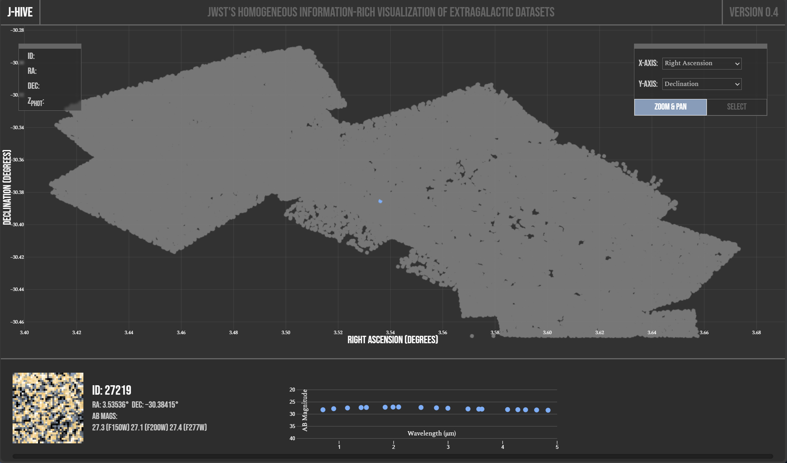

# The J-HIVE Visualization Tool

The J-HIVE Visualization Tool is an open-source, browser-based visualization and exploration tool for JWST data as uniformly processed through the [J-HIVE](https://www.j-hive.org/) collaboration.




Some important features of the J-HIVE Visualization Tool:

- Rendering of visualizations using WebGL through the [Pixi.js](https://pixijs.com/) library, providing the ability to handle a million individual data points in browser.
- Rapid Exploration and Context of JWST catalog sources with connections to a diversity of metadata
- Interfaces and Interconnection to the underlying [Dawn JWST Archive](https://dawn-cph.github.io/) used to generate J-HIVE Data 


## Development

The development of the J-HIVE Visualization Tool is led by [Sidrat Research](https://www.sidratresearch.com/) under the direction of the J-HIVE Collaboration. 

### Installing Development Environment

To install the current develoment environment, run:

```npm install```

### Running Development Server

To run the current dev server, run:

```npm run dev```


### Building Production Version

To build the production version of the webapp, run:

```npm run build```

The exported version of the webapp will be written to the `dist/` folder. 

## Feedback

Please send all feedback to jhive@wellesley.edu